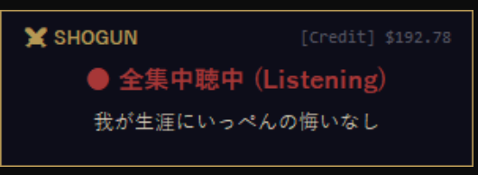
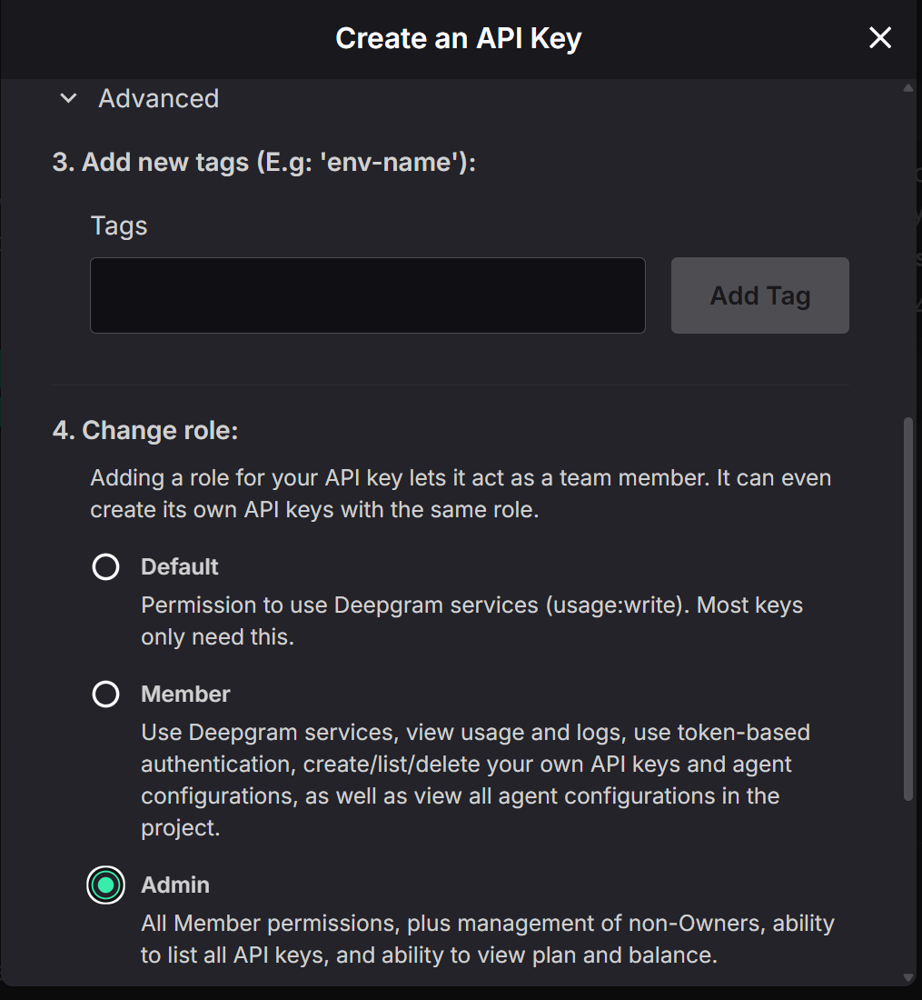

<div align="center">

# shogun-speech-2-text

**Windows+Hの精度に絶望した将軍が作った**

Deepgram Nova-3 によるリアルタイム音声認識ツール。
マイクに喋れば、どのアプリにもテキストが入る。それだけ。

[](https://github.com/yohey-w/shogun-speech-2-text)
[](https://opensource.org/licenses/MIT)
[](https://github.com/yohey-w/shogun-speech-2-text/releases/tag/v1.0.1)
[](https://python.org)

[English](README.md) | [日本語](README_ja.md)

</div>

<p align="center">
  
</p>

<p align="center"><i>Ctrl+Space → 喋る → アクティブウィンドウにテキスト入力。$200無料クレジット付き。</i></p>

---

## クイックスタート

**必要なもの:** Python 3.10+、Windows、Deepgram APIキー（無料）

```bash
git clone https://github.com/yohey-w/shogun-speech-2-text.git
cd shogun-speech-2-text
install.bat          # venv作成 + 依存インストール
# .env を編集 → DEEPGRAM_API_KEY を設定
start.bat            # 起動！
```

**Ctrl+Space** を押して、喋れ。

> **初めて？** 下のAPIキー取得手順へ — 30秒で終わる。

---

## なぜ作ったか

| | Windows+H | shogun-speech-2-text |
|---|-----------|---------------------|
| **認識精度** | 微妙 | かなり高い |
| **レイテンシ** | 2-3秒遅延 | ほぼリアルタイム |
| **技術用語** | 壊滅 | まあまあいける |
| **安定性** | たまにフリーズ | 自動再接続 |
| **コスト** | 無料 | $200無料（実質∞） |
| **部分認識** | なし | 喋りながら表示 |

---

## 特徴

- **Deepgram Nova-3** — 最新の日本語STT。Windows+Hとは比較にならない精度
- **リアルタイム** — 喋りながら部分認識結果を即座に表示
- **クリップボード送信** — 確定テキストをCtrl+Vでアクティブウィンドウに自動貼り付け（IME対応）
- **フローティングUI** — Ctrl+Spaceで常に最前面の小窓を表示、即座に認識開始
- **残高表示** — Deepgramクレジット残高をウィンドウに表示
- **自動再接続** — WebSocket切断時に自動復帰
- **ウォッチドッグ** — 無応答接続の自動検知（30秒タイムアウト）
- **辞書登録（Keyterm）** — 技術用語を事前登録して認識精度を向上（`.env` で設定）

---

## APIキー取得（無料）

1. [Deepgram Console](https://console.deepgram.com) にアクセス
2. **Googleアカウント**でサインアップ（$200無料クレジット、カード不要）
3. APIキーを作成 — **Adminロール**を選択すると残高表示が有効に
4. `.env` には **Secret** を貼り付け
5. **Identifier** のUUIDはAPIキー本体ではない。**Secret** は作成時に一度だけ表示される

<p align="center">
  
</p>
<p align="center"><i>「4. Change role」で「Admin」を選択すると残高表示が使える。</i></p>

> あなたがGoogleアカウントをいくつ持っているかは、あなただけが知っている。

---

## 使い方

### フローティングウィンドウ（推奨）

```bash
python floating_window.py
```

| キー | 動作 |
|------|------|
| **Ctrl+Space** | 認識ON/OFF切替 |
| **Esc** | 停止 & ウィンドウ非表示 |
| **Ctrl+C** | アプリ終了 |
| **ドラッグ** | ウィンドウ移動 |

### タスクトレイ版

```bash
python tray.py
```

### コンソール版

```bash
python main.py
```

---

## 辞書登録（Keyterm Prompting）

技術用語を事前登録すると認識精度が大幅に向上する（最大90%改善）。

`.env` にカンマ区切りで登録:

```bash
DEEPGRAM_KEYTERMS=デプロイ,WebSocket,API,GitHub,Claude,将軍システム
```

- 上限: 1リクエスト500トークン（推奨20-50語）
- 固有名詞・社内用語・技術用語に効果大
- 空にすれば無効化
- 非ASCII文字を使う場合は `.env` を UTF-8 で保存すること

---

## 注意

- Windowsスタートアップ登録は [Issue #1](https://github.com/yohey-w/shogun-speech-2-text/issues/1) で検討中。v1.0.1 では見送っている。

---

## ファイル構成

```
shogun-speech-2-text/
├── floating_window.py  # フローティングUI版（推奨）
├── tray.py             # タスクトレイ常駐版
├── main.py             # STTコア + 残高確認API
├── requirements.txt
├── .env.example
└── docs/
    └── floating_window.png
```

---

## コスト

| 項目 | 値 |
|------|-----|
| Deepgram Nova-3 | $0.0059/min ($0.35/h) |
| 無料クレジット | **$200 / Googleアカウント** |
| 無料で使える時間 | 約571時間 |
| 1日3時間使用 | 約190日間無料 |

---

## トラブルシューティング

### pyaudio のインストールで詰まる場合

**Windows:**
```bash
pip install pipwin && pipwin install pyaudio
```

**Linux/WSL2:**
```bash
sudo apt-get install portaudio19-dev && pip install pyaudio
```

### ホットキーがIMEと競合する

`floating_window.py` の `HOTKEY` を変更:
```python
HOTKEY = "<ctrl>+<alt>+<space>"  # お好みのキーコンビネーション
```

### WSL2 の制約

クリップボード貼り付けはWindows上でPythonを直接実行する必要があります。コンソール出力のみならWSL2でも動作します。

---

## License

MIT
